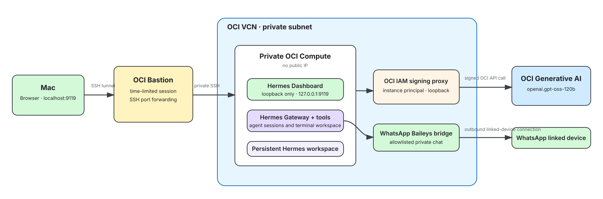

# hermes-oci-dev-agent

Private, always-on [Nous Hermes Agent](https://github.com/NousResearch/hermes-agent)
on OCI Compute, configured as a single-user developer agent. It uses OCI Generative
AI through the Compute instance principal, so no reusable model API key is stored on
the VM.

Hermes is installed using its supported installer:

```sh
curl -fsSL https://hermes-agent.nousresearch.com/install.sh | bash
```

The Hermes Dashboard is only reachable through an OCI Bastion SSH tunnel, while model
calls use the Compute instance principal through a localhost OCI Generative AI signing proxy.

## What Hermes can do

The initial deployment is deliberately scoped for developer work:

- Work inside its dedicated `/home/hermes/workspace` directory.
- Read and edit code, create artifacts, and run terminal commands and tests.
- Handle ticket-style requests such as “investigate DEV-123”, “add tests”, or
  “prepare a PR summary”.
- Persist its workspace and sessions across service or VM restarts.

Messaging integrations—including WhatsApp—and external MCP servers remain disabled by
default. Enable them only after establishing repository permissions and an approval
policy for pushes, pull requests, deployments, and destructive commands.



The editable source is [docs/hermes-oci-architecture.excalidraw](docs/hermes-oci-architecture.excalidraw).

## Prerequisites

- Terraform >= 1.7 and authenticated OCI CLI credentials on your Mac.
- An OCI compartment, region, availability domain, Oracle Linux image OCID, SSH public
  key, and OCI Generative AI project OCID.

## Quick start

First, create your local deployment values. This file is intentionally ignored by
Git and must never be committed.

```sh
cp terraform/terraform.tfvars.example terraform/terraform.tfvars
# Edit terraform/terraform.tfvars and fill every REQUIRED value.
```

Then run either target from the repository root:

```sh
make provision  # Create/update the Terraform-managed OCI stack.
make dashboard  # Open http://localhost:9119; Ctrl-C closes the tunnel and session.

# Or perform both steps in one command:
make up
```

`make dashboard` creates a three-hour Bastion port-forwarding session, opens both
SSH hops, and revokes the session when you press Ctrl-C. It obtains the region,
Bastion ID, instance ID, and private IP from Terraform outputs—nothing needs to be
copied manually. The default SSH key is `~/.ssh/id_rsa`; override it when needed:

```sh
make dashboard SSH_PRIVATE_KEY="$HOME/.ssh/id_ed25519"
make dashboard LOCAL_DASHBOARD_PORT=9919
```

The SSH private key must be the counterpart of `ssh_public_key` in
`terraform.tfvars`. If the Dashboard port is already in use, select another local
port as shown above and browse to that port instead.

Cloud-init creates the dedicated non-root `hermes` user, runs the official installer,
configures the OCI signing proxy, and starts the services. First boot can take several
minutes. For maintenance, use `make dashboard`, then in another terminal run:

```sh
ssh -i ~/.ssh/id_rsa -o IdentitiesOnly=yes -p 2222 opc@127.0.0.1 \
  'sudo journalctl -u cloud-final -f'
```

Use the Dashboard's **Chat** view for a live developer-agent conversation. The
**Sessions** view is for reviewing saved sessions and their workspace activity.

The Dashboard listens only on VM loopback and has no public IP or internet ingress.
It is reachable only through the time-limited Bastion-and-SSH tunnel; when the tunnel
ends, browser access ends while the Hermes gateway remains running.

## Model configuration

The included OCI GenAI signing proxy signs requests with OCI's instance-principal credentials and
forwards them to the region's OpenAI-compatible Generative AI API. Hermes sees the
proxy as an OpenAI-compatible `custom` provider at `http://127.0.0.1:8181/v1` and has
no OCI API key. The proxy supplies the OCI Generative AI project and compartment context
required by the endpoint.

Choose a tool-calling model that is enabled in the configured OCI region and set its
exact ID in `genai_model_id`. The current tested default is `openai.gpt-oss-120b`.
The included verification script validates the selected model with a streaming tool-call
request before Hermes is considered ready.

## Suggested developer-agent workflow

1. Give Hermes a bounded task, including the repository path and acceptance criteria.
2. Have it inspect the code and propose its approach before editing.
3. Let it implement and run the relevant tests in its dedicated workspace.
4. Review the diff and test output in the Dashboard.
5. Add GitHub or a ticket integration later, with an explicit human approval step before
   any external write such as a push, pull request, or deployment.

## Operations

```sh
sudo systemctl status hermes-genai-proxy hermes-gateway hermes-dashboard
sudo journalctl -u hermes-gateway -f
sudo systemctl restart hermes-gateway hermes-dashboard
```

If the Dashboard displays an HTTP error, inspect the model proxy and Dashboard together:

```sh
sudo journalctl -u hermes-dashboard -u hermes-genai-proxy -n 100 --no-pager
```

An OCI HTTP `429` normally means the selected on-demand model is temporarily at
capacity; switch to another enabled model or retry later. An HTTP `400` generally
indicates an unsupported model or request shape and should include a useful OCI error
in the proxy log.

Use `terraform destroy` only when you intentionally want to remove the Compute,
networking, and persistent block volume.
